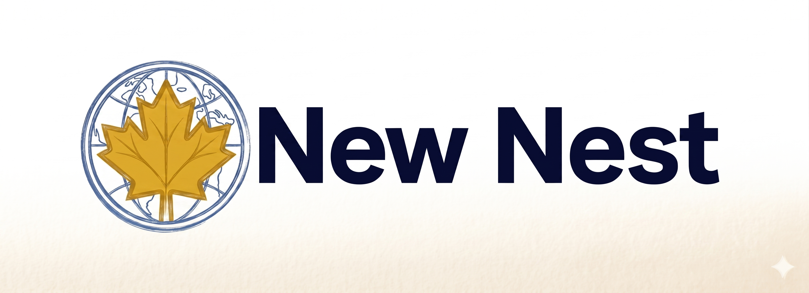

# **New Nest**

## About APP 

New Nest is a mobile news application built with **React Native** that delivers the latest headlines together with real-time weather information in a clean and modern interface.

This project represents my learning journey into mobile development, focusing on scalable architecture, reusable components, and modern application design.

---

## Preview

<!-- You can place your app logo or screenshot here -->

---

## Features

- News feed powered by external News API
- Category-based navigation
- Weather information based on user location
- Clean and minimal mobile UI
- Component-based architecture
- Scrollable news experience
- Modular and scalable folder structure

---

## Tech Stack

- React Native
- Expo
- JavaScript (ES6+)
- News API
- Mobile-first design principles

---

## Project Structure

estructura de directorios

---

## Architecture Philosophy

The project follows a **Feature + UI separation** approach:

- **UI Components**
  - Pure visual components
  - Reusable across the app
  - No business logic

- **Feature Components**
  - Combine UI components
  - Represent real app functionality
  - Connected to data sources

This structure allows the project to scale without rewriting existing components.

